# ML платформа

## Платформа в кластере


Загрузим предварительно конфигурации в развёрнутый кластер командами

```bash
helm upgrade --install monitoring prometheus-community/kube-prometheus-stack --version 91.5.2 -n monitoring --create-namespace -f platform/monitoring-values.yaml --wait --timeout 15m

helm upgrade --install traefik traefik/traefik --version 41.6.0 -n traefik --create-namespace -f platform/traefik-values.yaml --wait
```

Далее применим mlfow.yaml, airflow.yaml, ingress.yaml

Вывод команды 

```bash
kubectl get pods,ingress -A
```

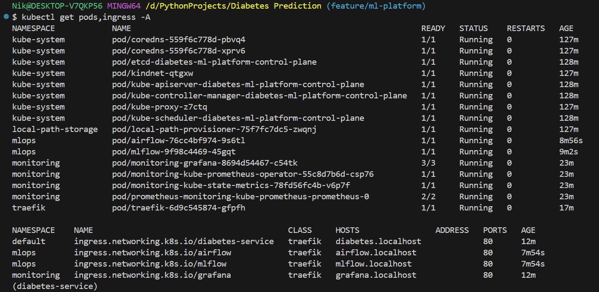

Зайдем на http://mlflow.localhost и увидим запущенный MLflow

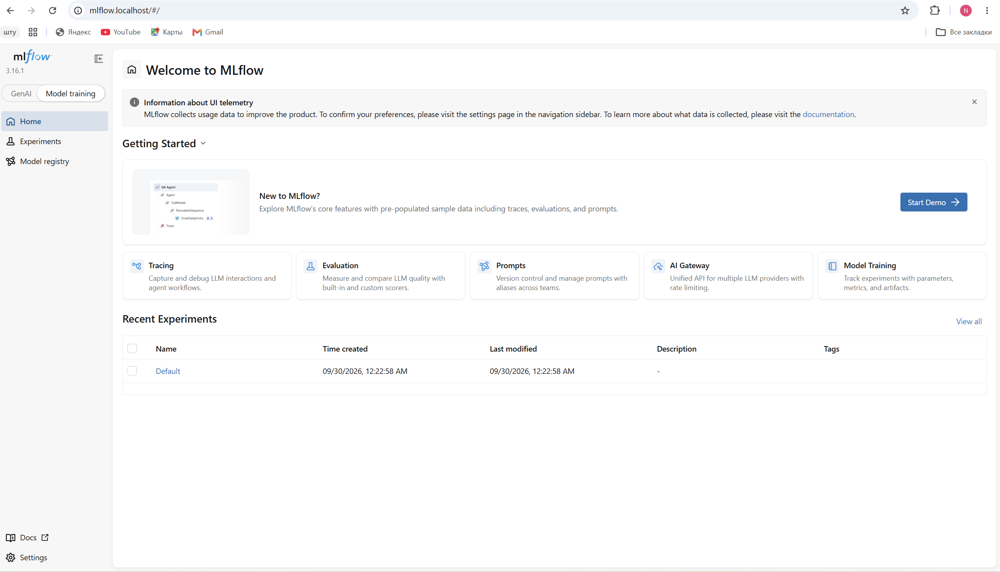


## Обучение, реестр и гейт

Выберем метрику pr_auc для оценки, порог для гейта установим на уровне 0.0001 для наглядности демонстрации того, как mlflow версионирует модели и устанавливает метку champion у победившей модели, метку challenger у модели кандидата на победителя. В случае, если challenger лучше, то с прошлой модели снимается метка champion и новому победителю присваивается метка champion. Залогируем график PR-кривой в MLFlow через mlflow.log_figure. 

Сделаем три запуска модели и посмотрим как модели присваивается метка в зависимости от того прошла ли она гейт ли или нет (будем изменять параметр регуляризации С). Порог гейта установлен на уровне превышения 0.0001 по метрике pr_auc. При первом запуске присвоится версии модели метка champion и challenger в MLFlow

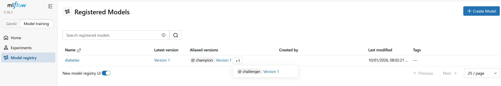

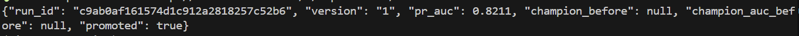

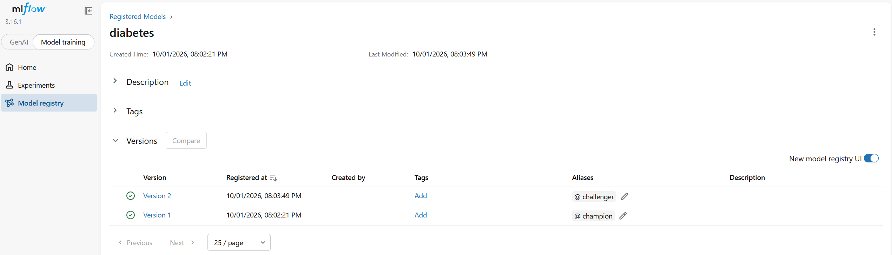

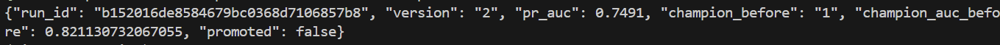

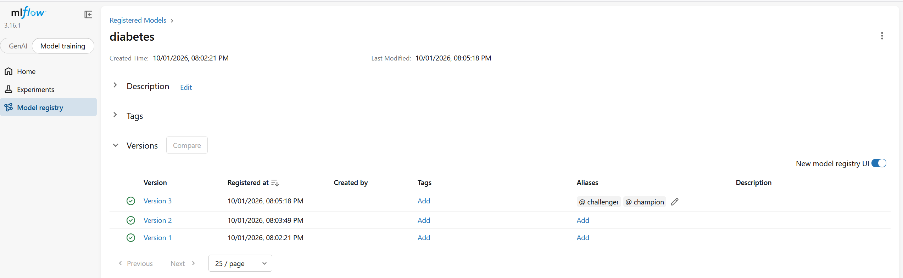

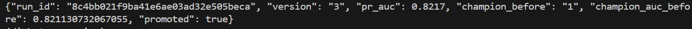


## Сервис по алиасу и откат модели
Сервис на старте спрашивает у реестра <модель>@champion, а без MODEL_NAME грузит файл, чтобы тесты в CI шли без MLflow. /health показывает версию из реестра. Затем откатим модель без
пересборки образа: в UI перевесим champion на прошлую версию и перезапустим поды.

Выполним команды

```bash
kubectl rollout restart deploy/diabetes-service
kubectl rollout status deploy/diabetes-service
curl http://diabetes.localhost/health
```

Посмотрим на вывод health до отката модели и после отката (не забудем создать предварительно секреты локально в кластере для нашей базы через kubectl create secret иначе поды сервиса упадут с ошибкой из-за config error)

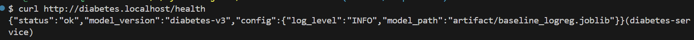

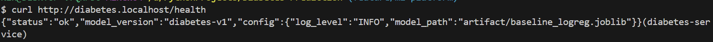

Время от смены модеди в UI MLflow до ответа другой версии champion составило порядка 8 секунд

## CI/CD кластер
Чтобы произошел deploy необходимо в разделе actions после merge с main выбрать наш workflow и нажать run workflow.

Ссылка на job:https://github.com/Npudov/ML-Service-Diabetes-Prediction/actions/runs/36784375703

На картинке представлен локальный github runner из интерфейса github

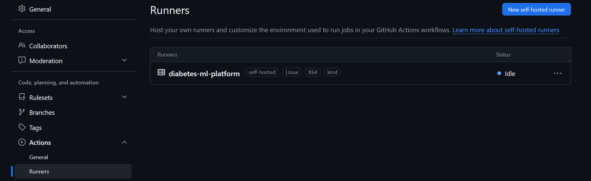

## Версии данных в DVC

Подключим dvc к проекту

uv add ‐‐dev dvc
uv run dvc init
git rm ‐r ‐‐cached datasets/<датасет>.csv # только если датасет уже был в git
uv run dvc add datasets/<датасет>.csv
uv run dvc remote add ‐d local ../dvc‐storage
git add data/<datasets>.csv.dvc data/.gitignore .dvc/config .dvcignore pyproject.toml uv.lock
git commit ‐m "data: датасет под DVC"
uv run dvc push


Файл .csv.dvc находится в репозитории.
Вывод dvc push и dvc diff:

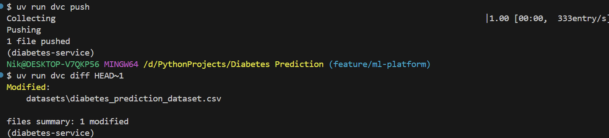

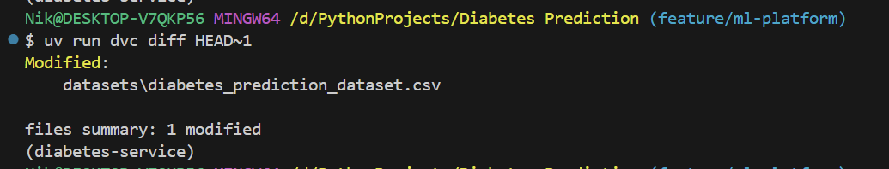


Вывод dvc pull

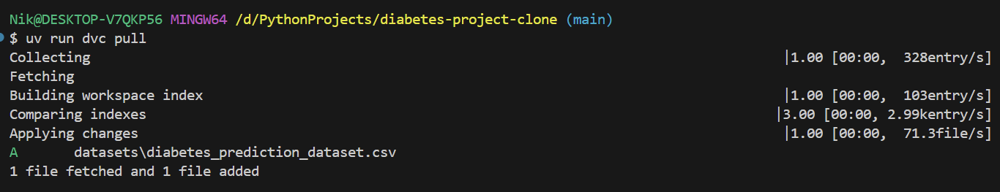

Вывод в MLFlow с data_md5

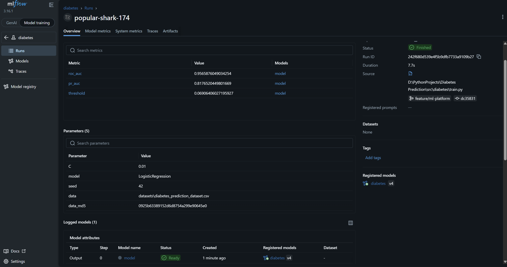

Сделаем откат модели

```bash
git checkout HEAD~1 ‐‐ datasets/diabetes_prediction_dataset.csv.dvc
uv run dvc checkout # файл стал прошлой версии
git checkout HEAD ‐‐ datasets/diabetes_prediction_dataset.csv.dvc
uv run dvc checkout # снова текущая
```

и вновь выведем результаты эксперимента в MLFlow
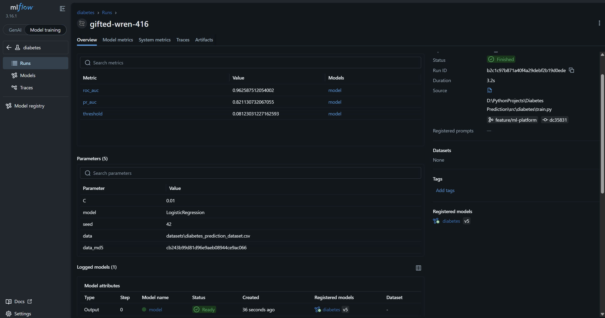

data_md5 изменился

## Автомасштабирование в HPA
Произведем настройку hpa в paltform/metrics-server-values.yaml и k8s/hpa.yaml

Также предварительно выполним команды

```bash
helm repo add metrics‐server https://kubernetes‐sigs.github.io/metrics‐server/
helm upgrade ‐‐install metrics‐server metrics‐server/metrics‐server \
--version 3.14.0 -n kube‐system -f platform/metrics‐server‐values.yaml --wait
```

Далее проведём нагрузочное тестирование через locust. Запустим его командой с выводом в консоль, предварительно нужно поднять наш сервис на порту 8000 (можно через docker compose)

```bash
uv run --with locust locust -f locustfile.py --headless -u 10 -r 5 -t 60s --csv run10_with_hpa -H http://diabetes.localhost
```


```bash
uv run --with locust locust -f locustfile.py --headless -u 50 -r 10 -t 60s --csv run50_with_hpa -H http://diabetes.localhost
```

```bash
uv run --with locust locust -f locustfile.py --headless -u 100 -r 20 -t 60s --csv run100_with_hpa -H http://diabetes.localhost
```


На первом прогоне получаем такие результаты

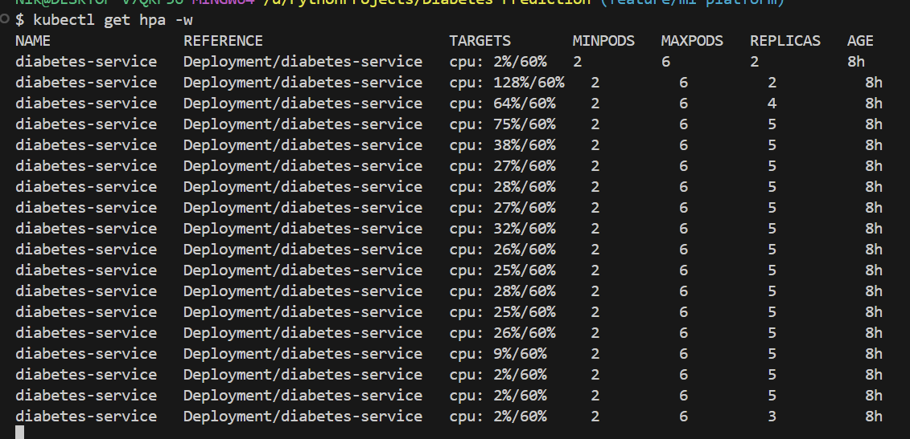

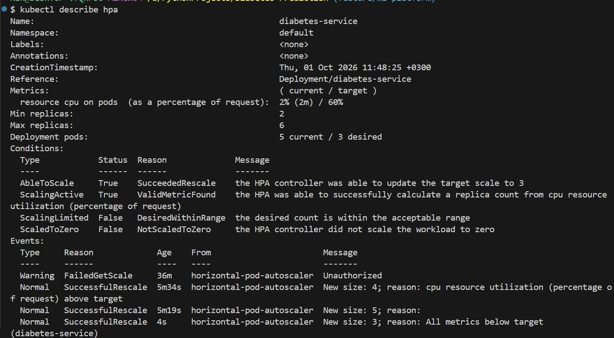

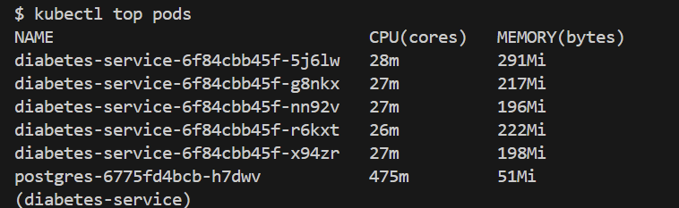

Количество подов сервиса увеличилось с 2 до 5, затем после окончания тестирования снизилось cначала до 3.

На втором прогоне получаем следующие результаты

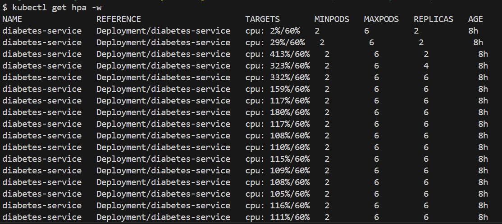

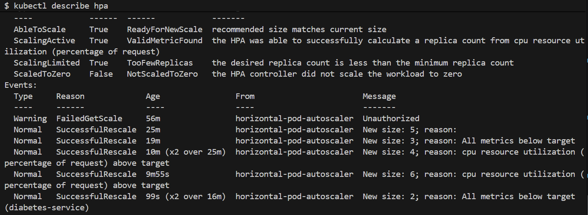

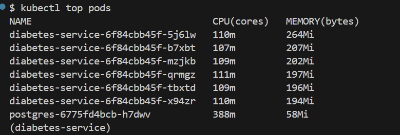

Количество подов сервиса увеличилось с 2 до 6, затем после окончания тестирования снизилось cразу до 2 спустя минут 5.

На третьем прогоне получаем следующие результаты

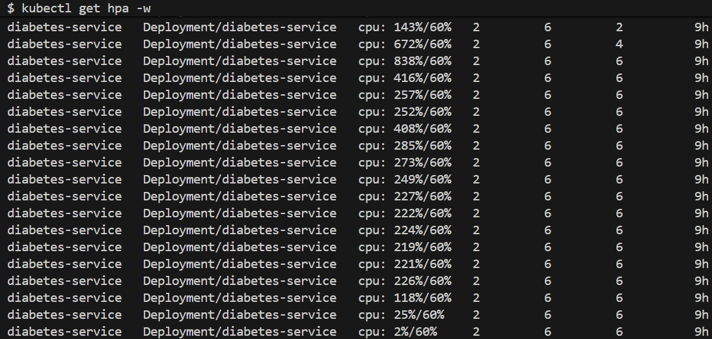

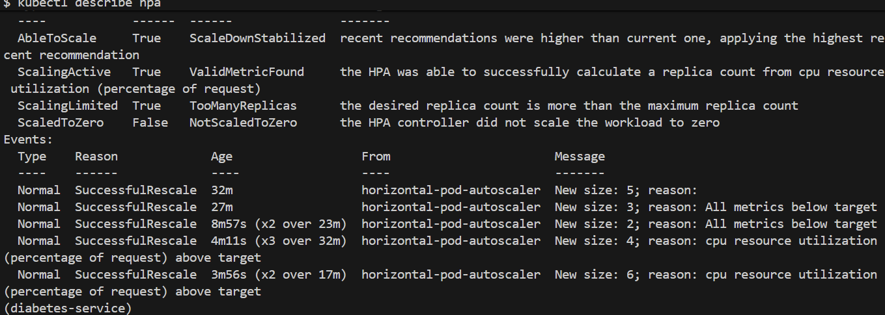

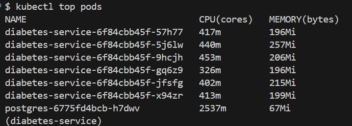

Количество подов сервиса увеличилось с 2 до 6 достаточно быстро. Также у нас возникло 4 ошибки сервиса под нагрузкой


Исходя из результатов прогонов и пиковых значений памяти у подов, возможно уменьшить requests для нашего сервиса до уровня 150-160Mi. Сейчас requests стоит на уровне 256Mi

Итоговая таблица с тремя прогонами:


| Тест | Тип | Имя | Запросов | Ошибок | Медиана (мс) | Среднее (мс) | Мин (мс) | Макс (мс) | Ср. размер (Б) | Запросов/с | 50% | 75% | 90% | 95% | 98% | 99% | 99.9% | 100% |
| :--- | :--- | :--- | :--- | :--- | :--- | :--- | :--- | :--- | :--- | :--- | :--- | :--- | :--- | :--- | :--- | :--- | :--- | :--- |
| **Run 1** | POST | `/v1/predict` | 3103 | 0 | 9 | 12.31 | 7.32 | 1723.71 | 144.42 | 12.96 | 9 | 9 | 10 | 12 | 14 | 20 | 1100 | 1700 |
| **Run 2** | POST | `/v1/predict` | 15419 | 0 | 9 | 13.64 | 7.03 | 1669.85 | 144.42 | 64.71 | 9 | 10 | 14 | 17 | 27 | 58 | 660 | 1700 |
| **Run 3** | POST | `/v1/predict` | 29982 | 4 | 10 | 38.7 | 7.22 | 3963.77 | 144.37 | 125.30 | 10 | 14 | 22 | 66 | 200 | 500 | 3600 | 4000 |

## Воспроизведение ошибок

1. Сделаем ошибку будто модели нет в реестре, поставим ConfigMap алиас, которого нет (production).

Deploy упал на шаге сервис и вывел в лог ошибку error timeout on condition. В логах контейнеров видно было, что наш под с diabetes-service в состоянии CrashLoopBackOff. По логу тяжело определить,что причина была именно в неправильном alias модели.

Ссылка на неуспешную job: https://github.com/Npudov/ML-Service-Diabetes-Prediction/actions/runs/36905245597
Ссылка на успешную job: https://github.com/Npudov/ML-Service-Diabetes-Prediction/actions/runs/36906558666

2. Укажем в ci.yml неверный KIND_CLUSTER и RUNNER не увидит кластер

Деплой упал на шаге kind, kubectl доступ к кластеру с ошибкой ERROR: could not locate any control plane nodes for cluster named 'diabetes-ml-platform-error'. Use the --name option to select a different cluster. По логу видно,что runner не смог найти кластер с таким именем и просит указать другой.

Ссылка на неуспешную job: https://github.com/Npudov/ML-Service-Diabetes-Prediction/actions/runs/36907244076
Ссылка на успешную job: https://github.com/Npudov/ML-Service-Diabetes-Prediction/actions/runs/36908406667

3. Укажем хост в k8s/ingress.yaml не совпадающий с deploy на шаге smoke

Деплой нигде не упал, похоже Traefik смог при не совпадении имени хоста перенаправить трафик по имени сервиса через backend

Ссылка на неуспешную job: https://github.com/Npudov/ML-Service-Diabetes-Prediction/actions/runs/36911002475
Ссылка на успешную job: https://github.com/Npudov/ML-Service-Diabetes-Prediction/actions/runs/36913816766

## Ключевые моменты
1. GitHub-облако не имеет сетевого доступа к локальному кластеру Kind (он за NAT). Тестам и сборке образа доступ к кластеру не нужен, а деплою нужен kubectl. Был выбран self-hosted runner поскольку он крутится прямо на хост-машине в сети Docker и видит кластер kind. Альтернативой могло бы быть использование туннелей ngrok, cloudflared.
2. Runner запущен с --network kind поскольку необходимо разместить его в той же докер сети, иначе он не достучиться до кластера. Сокет докера пробрасывает Docker-демон с хост машины в раннер и runner получает возможность выполнять команды docker pull и kind load docker-image, без этого при выполнении данных команд будет ошибка --group-add 0 необходимо,чтобы runner Добавили в группу root пользователей иначе возникнет ошибка прав доступа
3. Конструкция ‐‐dry‐run=client ‐o yaml | kubectl apply при создании секретов необходима поскольку позволяет создать их как и create secretи полученную конфигурацию сформировать в yaml и применить kubectl apply. Без этого при втором деплое команда create secret завершится ошибкой так как секрет уже будет существовать
4. challenger в MLflow - моедль кандидат, она ещ    ё не прошла гейт контроля качества, для того,чтобы стать champion и на неё не направлен реальный трафик. Champion это лучшая модель по соответствующей метрике, которая прошла гейт и на неё направляется трафик. В коде мы используем для загрузки лучшей модели именно alias, а не номер версии поскольку нам в этом случае без разницы какой номер версии имеет лучшая модель и нам не нужно менять код,чтобы переключиться на другую версию, за нас все уже делает mlflow, а мы просто вытягиваем лучшую модель champion.
5. Если никто не обучит модель и мы запустим сервис в кластере, то код загрузит локальную модель в формате jobli, так как в Mlflow не будет ни одной модели. Откат модели происходит через смену метки, код, инфраструктура остается нетронутыми. Откат подов в k8s изменяет revision и зашитый в сервис докер образ,что влечет и изменение поведения кода
6. Браузер резолвит mlflow.localhost в 127.0.0.1 и стучится на порт 80 хост-машины. Docker перехватывает трафик на порту 80 и перенаправляет его внутрь контейнера Kind-ноды на NodePort 30080. Внутри кластера Traefik маршрутизирует запрос (резолвит имя) и отправляет его на порт 5000 кластера и далее запрос попадает на 5000 порт контейнера mlflow. --allowed-hosts защищает от подмены хоста, если обратиться напрямую по IP, подставив свой домен, MLflow вернет ошибку. --cors-allowed-hosts настраивает CORS (Cross-Origin Resource Sharing). Если мы попытаемся обратиться к MLflow с другого хоста (к примеру grafana.localhost), то браузер заблокирует ответ MLflow из соображений безопасности. Этот флаг разрешает принимать ответы на такие запросы к MLFlow. Порт 80 задается при создании кластера так как Docker запускает kind внутри себя и с нашей хост машины необходимо пробросить порты. Если этого не сделать, то Docker не умеет их пробрасывать для уже запущенного контейнера
7. Метрика hpa по количеству реплик определяется по формуле число реплик = [текущие * метрика / цель]. Метрика и цель - проценты от requests. Цель задана в hpa.yaml. Исходя из наших результатов например при метрике 128% и таргете в 60% c текущим число подов 2 получится [2*128/60] = 4 пода, на скриншотах  числа с формулой согласуются. После спада нагрузки реплики уходят вниз дольше поскольку в kubernetes встроенная защита на случай, если спад нагрузки кратковременный. За это отвечает параметр stabilizationWindowSeconds. При росте нагрузки он устанавлен в значение 0 и поды создаются мгновенно (HPA каждые 15 секунд смотрит на метрику и принимает решение по количеству реплик). На спад нагрузки окно стабилизации установлено в 300 секунд по умолчанию (5 минут), что защищает от кратковременного падения нагрузки. На каждое создание пода Kubernetes тратит время.
8. В Git лежит код, конфиги и указатели на данные (файл .dvc с md5, размером и путём к файлу). В DVC лежат сами файлы с данными.Для восстановления данных нужно найти run_id версии модели и желательно,чтобы в параметрах в mlflow логировался хэш коммита, на котором был прогон модели. Далее командой Git checkout с указанием хэша мы переводим гит в состояние на момент прогона модели. Далее вызываем uv run dvc pull и файл датасета .dvc заменят на файл из коммита с соответствующим md5. Далее DVC по данному md5 пойдет в хранилище и найдет там искомый датасет с этим md5.

## Возникающие проблемы

1. При локальном развёртывании без настроенного deploy можно забыть применить manifest из platform и в итоге mlflow, airflow, grafana доступны не были при обращении к ним по их адресу. Решение применить в начале манифесты kubectl apply -f platform/
2. В Windows при указании mlflow.localhost при отправке запроса через git bash с данными и моделью в mlflow - windows пишет ошибку с сокетами. Решение - в файле etc/hosts добавить строку 127.0.0.1 mlflow.localhost
